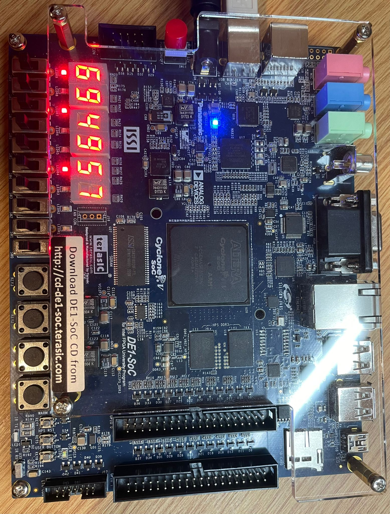

# baccarat-game-fpga
Implemented a digital simulation of the Baccarat game using Verilog, simulated on a DE1-SoC FPGA board. The design consists of two main parts: a finite state machine (FSM) to manage the game flow and a datapath that performs all the essential operations, such as card dealing and score computation.

### Features

- **Finite State Machine (FSM)**: Controls the game flow, including card dealing and score computation.
- **Datapath**: Handles all calculations, maintains player and dealer hands, and updates scores.
- **Coverage**: Achieved over 95% branch and line coverage on the Verilog RTL code tested with ModelSim and post-synthesis netlist generated by Quartus.
- **Testbenches**: Test the functionality of the components. Each testbench exercises the module’s interfaces and outputs.

## Modules

### Datapath

The datapath manages the game’s data and computation, including:
- **Deal Card**: Implements a random number generator for card dealing based on a fast clock.
- **Reg4**: A 4-bit wide register that stores card values.
- **Card 7-Segment Display**: Converts card values to a 7-segment display format.
- **Score Hand**: Computes the score of the hand based on the Baccarat rules.

### State Machine

The state machine controls the operation of the game by:
- Responding to player inputs.
- Managing transitions between states.
- Generating control signals to the datapath based on game rules.

## Tools/Programs

- **Software**: 
  - ModelSim
  - Quartus
- **Hardware**: 
  - DE1-SoC FPGA board

 ## FPGA

  
  

